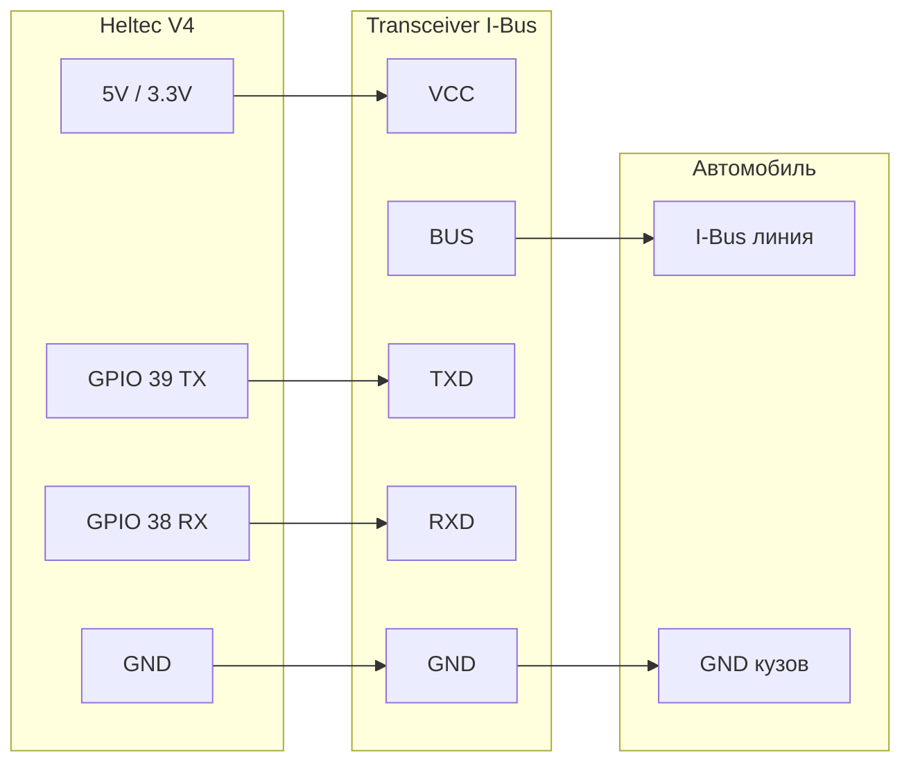

# Полная схема подключения Heltec V4 к BMW I-Bus

Один документ для сборки подключения «от платы до машины»: Heltec WiFi LoRa 32 V4 → трансивер I-Bus → автомобиль BMW (E39/E46/E38/E53 и совместимые). **Кратко:** плата (5 V, GND, GPIO 39 TX, GPIO 38 RX) → трансивер I-Bus → шина и масса в автомобиле.

Подробности по режиму BMW Assistant, протоколу и настройке — в [BMW_E39_Assistant.md](BMW_E39_Assistant.md).

---

## 1. Блок-схема

- **Плата:** питание 5 V или 3.3 V, земля, GPIO 39 (TX) и 38 (RX).
- **Трансивер:** преобразует TTL 3.3 V в уровень шины I-Bus (MCP2004A, TH3122 и т.п.).
- **Автомобиль:** один провод I-Bus и общая масса с кузовом.

---

## 2. Таблица подключения проводов

### Heltec V4 → Трансивер I-Bus

| Heltec (контакт / GPIO) | Трансивер (вывод) | Примечание |
|-------------------------|--------------------|------------|
| 5 V или 3.3 V (Ve)      | VCC                | Питание трансивера |
| GND                     | GND                | Общая земля |
| GPIO 39                 | TXD                | Передача в шину (Heltec TX → TXD трансивера) |
| GPIO 38                 | RXD                | Приём из шины (Heltec RX ← RXD трансивера) |

### Трансивер → Автомобиль

| Трансивер | Куда в машине | Примечание |
|-----------|----------------|------------|
| BUS       | Провод I-Bus   | Один провод шины (см. раздел 4) |
| GND       | Кузов (масса)  | Надёжный контакт с кузовом |

**Важно:** не перепутать TX и RX: **GPIO 39 (TX)** платы подключается к **TXD** трансивера, **GPIO 38 (RX)** — к **RXD** трансивера.

---

## 3. Трансивер I-Bus

- **Назначение:** преобразование уровней между TTL 3.3 V (Heltec) и однопроводной шиной I-Bus (9600 8E1).
- **Варианты:** MCP2004A, TH3122 или схема на оптопаре (см. [I-K_Bus](https://github.com/muki01/I-K_Bus)).
- Подробнее и формат шины — [BMW_E39_Assistant.md, раздел 3.2](BMW_E39_Assistant.md#32-подключение-к-i-bus).

---

## 4. Где в машине подключать I-Bus

- **Точки подключения:** разъём CD-чейнджера в багажнике (если есть проводка) или за магнитолой / в районе блока предохранителей.
- **Провод I-Bus:** ориентировочно белый/красный с жёлтыми точками; минус — коричневый (кузов).
- Детали и цветовая маркировка — [BMW_E39_Assistant.md, раздел 3.2](BMW_E39_Assistant.md#32-подключение-к-i-bus).

---

## 5. OBD (опционально)

Для RPM, температуры ОЖ и масла в прошивке предусмотрен опрос ELM327 по UART:

| Heltec      | ELM327 (UART) | Примечание |
|-------------|----------------|------------|
| GPIO 9 (TX) | RX             | Передача команд к ELM327 |
| GPIO 10 (RX)| TX             | Приём ответов |
| GND         | GND            | Общая земля |

- **Скорость:** 38400 8N1.
- **Питание ELM327:** от разъёма OBD-II автомобиля.
- В **`include/nocturne/config.h`** задать `NOCT_OBD_ENABLED 1` и при необходимости пины `NOCT_OBD_TX_PIN` / `NOCT_OBD_RX_PIN`. Подробнее — [BMW_E39_Assistant.md, раздел 3.4](BMW_E39_Assistant.md#34-obd2-опционально).

---

## 6. Чек-лист перед включением

- [ ] **Общая земля:** плата Heltec, трансивер и кузов соединены по GND.
- [ ] **Питание трансивера:** VCC в пределах допуска (3.3 V или 5 V в зависимости от модуля).
- [ ] **TX/RX не перепутаны:** GPIO 39 → TXD трансивера, GPIO 38 → RXD трансивера.
- [ ] **I-Bus в машине:** провод BUS трансивера подключён к шине, GND — к кузову.
- [ ] **Прошивка:** при использовании I-Bus в **config.h** задано `NOCT_IBUS_ENABLED 1`, пины 38/39 (по умолчанию `NOCT_IBUS_RX_PIN` / `NOCT_IBUS_TX_PIN`).

После проверки — питание платы, вход в режим BMW Assistant (меню → BMW → долгое нажатие). При работе шины на экране будет «IBUS OK»; для отладки пакетов — `NOCT_IBUS_MONITOR_VERBOSE 1` или `NOCT_BMW_DEBUG 1` в config.h: приём логируется в hex, отправляемые пакеты выводятся как `[IBus TX]`. Монитор порта 115200 бод.
